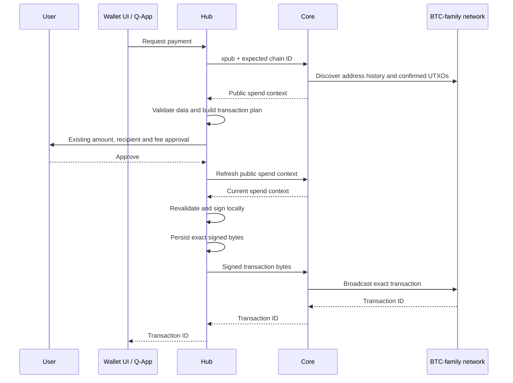

# Local signing for Bitcoin-derived wallets

## Purpose

Qortal Hub previously sent a wallet's extended private key to Qortal Core when
it needed Core to create and sign a BTC-family transaction. This worked, but it
gave Core everything needed to spend from that wallet.

This change moves transaction construction, approval and signing into Hub for:

- Bitcoin (BTC)
- Litecoin (LTC)
- Dogecoin (DOGE)
- DigiByte (DGB)
- Ravencoin (RVN)

Core now receives an extended **public** key (`xpub`) to find wallet activity and
an already-signed transaction to broadcast. Hub does not send the wallet's
extended **private** key (`xprv`) to Core, and it does not fall back to the old
private-key endpoints when the new endpoints are unavailable.

The main security property is simple:

> Core can help find coins and publish a payment, but it no longer receives the
> wallet key that can create payments.

## Plain-language explanation

Before this change, sending LTC was similar to handing Core the wallet key and
asking Core to prepare, sign and send the payment.

After this change, Core supplies public information about the wallet's coins.
Hub prepares the payment, shows the existing Hub permission prompt and signs the
approved payment locally. Core receives only the finished signed transaction and
broadcasts it to the Litecoin network.

A transaction signature is tied to the exact transaction. Core cannot change a
recipient, amount, fee or input without making the signature invalid. The signed
transaction also cannot be reused to authorize an unrelated future payment.

Core still learns the wallet's public key and transaction history because it
performs discovery. This is a privacy consideration, but an xpub cannot sign or
spend funds.

## What changed

| Feature                 | Previous behavior                                                                                 | New behavior                                                                                                     |
| ----------------------- | ------------------------------------------------------------------------------------------------- | ---------------------------------------------------------------------------------------------------------------- |
| Normal BTC-family sends | Hub sent the xprv to a Core send endpoint; Core constructed, signed and broadcast the transaction | Core supplies public spend data; Hub constructs, approves and signs locally; Core broadcasts signed bytes        |
| Q-App `SEND_COIN`       | The request eventually used Core's private-key send API                                           | The Q-App contract stays the same; Hub routes it through local signing                                           |
| Wallet Send UI          | Core performed signing                                                                            | The existing Hub permission prompt authorizes a locally signed transaction                                       |
| Buy-order funding       | Core used the wallet key to fund the trade                                                        | Hub validates the returned HTLC plan and signs its funding transaction locally                                   |
| Fees                    | A caller could provide a fee rate, with Hub defaults otherwise                                    | Custom fee rates remain supported; when omitted, Hub uses Core's configured rate and applies local safety limits |
| Send maximum            | No common local-signing path                                                                      | `sendMax: true` spends available confirmed funds minus the calculated fee                                        |
| Uncertain broadcasts    | A retry could risk constructing another payment                                                   | Hub journals the exact signed bytes and only offers to rebroadcast that transaction                              |
| Concurrent sends        | Requests could overlap                                                                            | Overlapping sends for the same wallet and coin are rejected                                                      |

## What did not change

- Q-Apps continue to call `qortalRequest()` with `SEND_COIN` or
  `CREATE_TRADE_BUY_ORDER`.
- Q-Apps never receive wallet private keys or raw signing access.
- The user still receives the normal Hub permission request. There is no second
  Electron confirmation dialog.
- QORT sending is unchanged.
- Pirate Chain (ARRR) keeps its separate wallet and transaction implementation.
- Public nodes can serve BTC-family sends and QORT trade buys through the local
  signer; creating sell offers and all ARRR trading still require a local node.
  Hub does not route public-node purchases through a trading proxy.
- Core's existing trade state machine still watches, redeems and refunds swaps.
- Legacy Core send endpoints remain available for older clients, but this Hub
  does not use them for BTC, LTC, DOGE, DGB or RVN.
- Existing wallet derivation remains unchanged, so existing addresses and funds
  remain in the same wallets.

## Ordinary send flow



Hub refreshes the spend context after approval. If the wallet, selected node,
inputs, outputs or trade intent changed during approval, Hub stops instead of
signing stale information. A changed fee recommendation also stops a payment
that relies on that recommendation, but it does not replace a fee explicitly
supplied by the caller.

## Q-App compatibility

An ordinary Q-App send keeps the existing request shape:

```js
const txId = await qortalRequest({
  action: 'SEND_COIN',
  coin: 'LTC',
  destinationAddress: 'ltc1...',
  amount: '0.10000000',
});
```

`recipient` is also accepted by the existing handler. A Q-App can continue to
supply `fee` in coin-per-byte units:

```js
const txId = await qortalRequest({
  action: 'SEND_COIN',
  coin: 'LTC',
  recipient: 'ltc1...',
  amount: '0.10000000',
  fee: '0.00000020',
});
```

To spend the confirmed available balance minus the transaction fee:

```js
const txId = await qortalRequest({
  action: 'SEND_COIN',
  coin: 'LTC',
  destinationAddress: 'ltc1...',
  sendMax: true,
});
```

`sendMax: true` must not be combined with `amount`. Q-Apps do not construct a
PSBT, provide an xpub or call the new Core endpoints themselves. Hub owns those
details and returns the resulting transaction ID through the existing Q-App
response path.

## Fee handling

Private keys are unrelated to fee discovery. Core already has a configured fee
rate for each supported network, expressed per 1,000 bytes. The public spend
context exposes this as an integer atomic-unit rate per byte, rounded upward.

Hub uses that rate when the request omits `fee`. If the request supplies a custom
positive rate, Hub honors it as the previous Core send flow did. Independent
per-coin ceilings still limit the rate and total fee. Hub calculates the fee
from the actual transaction plan and displays the planned fee in its normal
permission prompt.

The value is a configured recommendation, not a live mempool estimate. A future
fee-estimation change can improve that recommendation without changing where the
private key lives.

## Core API contract

All endpoints are authenticated with the normal Core API key.

### Public spend context

```http
POST /crosschain/{btc|ltc|doge|dgb|rvn}/wallet/public/spend-context
Content-Type: application/json
```

```json
{
  "xpub58": "<root extended public key>",
  "expectedChainId": "bip122:<mainnet genesis identifier>"
}
```

The version 1 response contains:

- the currency, mainnet identity and transaction-format constants;
- the current chain height;
- the minimum non-dust output and recommended fee rate as decimal strings;
- confirmed UTXOs with their receive/change derivation paths;
- the public scripts, values and full previous transactions needed to validate
  and sign legacy inputs.

Core rejects private extended keys and mismatched chain IDs. Discovery scans
both receive and change branches with a 20-address gap limit. It is bounded to
2,000 keys per branch, 1,000 outputs and 8 MB of distinct previous transaction
data. Exceeding a bound fails the request instead of returning a partial wallet.

For performance, Core checks address history, including mempool history, for the
full gap. It only requests unspent outputs for addresses that have history. A
normal wallet with one used address therefore needs roughly 42 address queries
instead of the original implementation's 82. Hub intentionally performs a fresh
scan after approval so it does not sign using stale inputs.

### Broadcast

```http
POST /crosschain/{btc|ltc|doge|dgb|rvn}/send/broadcast
Content-Type: application/json
```

```json
{
  "expectedChainId": "bip122:<mainnet genesis identifier>",
  "rawTransactionHex": "<locally signed transaction>"
}
```

Core parses and structurally verifies the transaction, broadcasts the exact
bytes, and requires the Electrum server to return the transaction ID calculated
from those bytes. It returns that transaction ID to Hub. A broadcast response is
an acknowledgement, not a blockchain confirmation.

### Exact transaction status

```http
POST /crosschain/{btc|ltc|doge|dgb|rvn}/wallet/public/transaction-status
Content-Type: application/json
```

```json
{
  "expectedChainId": "bip122:<mainnet genesis identifier>",
  "txId": "<transaction ID>"
}
```

This lightweight endpoint looks up only the transaction Hub already signed. It
does not receive the wallet xpub or private key. Core returns `UNKNOWN`,
`MEMPOOL` or `CONFIRMED`, together with the exact coin, network, chain ID and
transaction ID so Hub can reject a response for the wrong chain or transaction.

### Local trade preparation

```http
POST /crosschain/tradebot/respond/local
Content-Type: application/json
```

```json
{
  "addresses": ["<AT address>"],
  "xpub58": "<root extended public key>",
  "receivingAddress": "<Qortal address>",
  "expectedChainId": "bip122:<mainnet genesis identifier>"
}
```

The response contains the HTLC destinations, amounts, redeem scripts, refund
public-key hashes, secret hashes and lock times that Hub must validate before it
funds the trades.

## Local transaction construction and signing

Hub uses pinned `@scure/btc-signer` 2.4.1 for transaction parsing,
address/script encoding, BIP 174 PSBT handling, signature hashes, signing and
finalization. It uses the existing HD wallet roots and derivation scheme, so the
change does not create new wallets.

The local flow performs these checks:

1. Parse the public spend context with strict type, size and network checks.
2. Verify each previous transaction hash and the referenced output index.
3. Verify each UTXO's value and locking script against its previous transaction.
4. Derive the public child key at the supplied path and verify that it owns the
   input address and script.
5. Select confirmed inputs and calculate outputs, change and fee with integer
   atomic units (`bigint`), avoiding floating-point money calculations.
6. Validate recipient formats and per-coin policy bounds.
7. Obtain permission through Hub's existing approval dialog.
8. Fetch current spend data and require the planned transaction to remain the
   same.
9. Build a PSBT containing full previous transactions, derivation metadata,
   final sequences and `SIGHASH_ALL`.
10. Rebuild and compare the expected PSBT at the signer boundary before accessing
    the key.
11. Sign locally, finalize the transaction and compare its unsigned bytes with
    the approved unsigned transaction.
12. Verify the final fee, transaction ID and serialized size before persistence
    and broadcast.

The PSBT and private key are never included in a Core request.

## Desktop, browser and Android behavior

On Electron, Hub transfers the five BTC-family roots to an in-memory main-process
signer session when the wallet unlocks. The signer provides public-key lookup and
transaction signing operations; it does not expose key export or arbitrary
message/digest signing. IPC is restricted to the main Hub window's main frame.

The normal Hub permission prompt occurs before the signing request. The signer
does not display a duplicate native confirmation. It still reconstructs and
validates the expected transaction before signing. Logout, account replacement,
navigation, renderer failure or window destruction clears the signer session.
The signer does not persist its private keys.

Browser and Android builds perform the same transaction construction, checking
and signing locally in their application context. They also keep the private key
out of Core requests.

## Trade funding

Local funding supports ACCTv3 buy orders for the five listed coins. Core first
creates and durably stores a pending trade record in
`ALICE_WAITING_FOR_FUNDING` (state 80), including the watch-only wallet xpub and
the separate trade key and secret. It then returns the funding plan.

Hub binds that plan to the selected offers and verifies:

- AT identity and requested Qortal receiving address;
- seller public-key hash;
- HTLC redeem script and derived P2SH address;
- foreign amount plus the bounded funding reserve;
- lock time and expiration window.

Hub signs one transaction containing the validated HTLC outputs. Core observes
confirmed funding and continues the existing offer-message, AT-lock, redeem and
refund state machine, including when Hub is closed.

The trade-specific private key and secret remain in Core because Core needs them
to complete or refund an active trade. They are newly generated for that trade
and are not the wallet's root private key. This change is specifically about
keeping the reusable BTC-family wallet xprv out of Core.

Repeated preparation of the same pending trade is idempotent. Existing trades
are not rewritten or deleted. An older Core must not replace an updated Core
while state 80 trades exist because it does not understand that state.

## Broadcast journal and duplicate-payment prevention

A network timeout does not prove that a broadcast failed. Creating a new payment
after a timeout can spend a second set of inputs and pay twice.

Before broadcast, Hub saves:

- the transaction ID;
- the exact signed transaction bytes;
- the input outpoints reserved by the transaction;
- the broadcast deadline for time-sensitive trade funding.

Electron stores this in a dedicated fsynced journal and uses exclusive creation
to arbitrate concurrent application instances. Browser and Android use local
storage and Web Locks where available. Overlapping sends for the same wallet and
coin are rejected rather than queued.

Hub keeps a reservation after a successful broadcast acknowledgement. It checks
the exact transaction on login, when the selected Core changes, when the window
regains focus, every minute while the wallet is unlocked, and before another
send. A confirmed transaction clears the reservation automatically. If this
happens during a new send, that send continues to its normal payment approval.
An unconfirmed mempool transaction remains reserved and blocks a new payment.

If a Core reports `UNKNOWN`, Hub keeps the reservation because a newly selected
or out-of-sync Core might simply not have seen the transaction yet. The next
send can offer to rebroadcast only the exact saved bytes with explicit
permission. Recovery never builds a replacement transaction and never reports
an older recovered payment as success for a new request. Changing Core aborts
an in-flight automatic check, and the result is ignored unless the same wallet
and Core are still selected.

Corrupt journal entries, old entries without saved bytes, expired trade-funding
transactions and abandoned desktop lock files fail closed and require manual
investigation.

## Security properties and trust boundaries

This change provides the property it was designed for: **Core does not receive
the reusable BTC, LTC, DOGE, DGB or RVN wallet private key from the updated
Hub.**

It also limits what Core can do with a valid signed transaction. The signature
commits to its inputs and outputs, so changing payment details invalidates it.
Hub independently enforces fee and response-size ceilings before signing.

The remaining trust boundaries are:

- Core supplies chain data. Hub validates internal consistency and ownership,
  but does not independently synchronize block headers or verify inclusion
  proofs.
- Core sees the wallet xpub and can observe its derived address history.
- Core retains separate per-trade keys and secrets for swap execution and
  refunds.
- Electron's main process holds the BTC-family roots in memory while the wallet
  is unlocked.
- The existing Qortal unlock and seed-derivation flow still runs in the renderer,
  and Qortal's Ed25519 secret contains the account seed used to derive these
  wallets. This is not a hardware-backed or fully isolated seed vault.
- JavaScript strings cannot be reliably zeroized; clearing a session releases
  references but cannot guarantee immediate memory erasure.

These limits do not change the primary result: no updated Hub request sends the
wallet xprv to Core.

## Supported transaction scope

The current implementation supports:

- mainnet BTC, LTC, DOGE, DGB and RVN;
- confirmed legacy P2PKH wallet inputs using existing receive/change derivation;
- P2PKH and P2SH recipients for all five coins;
- witness-v0 recipient outputs for BTC, LTC and DGB;
- ordinary coin transfers and ACCTv3 trade funding.

It does not add:

- SegWit wallet-input derivation;
- Taproot;
- Litecoin MWEB;
- Ravencoin asset transactions;
- testnet wallets;
- ACCTv1 local funding;
- proxy-node trade buys;
- fresh change-address allocation (change currently returns to a verified
  selected input address).

PSBT expansion is limited to 8 MB of repeated previous-transaction data and 256
MiB of repeated validation work. Very fragmented wallets may need smaller
payments.

## Failure behavior and compatibility

Hub fails rather than sending a private key when Core does not support the new
endpoints. Users must run matching updated Hub and Core versions.

Typical failures include:

- `upgrade`: Core or the desktop bridge does not expose the required API;
- `changed`: the wallet, node, spend data or trade intent changed during the
  approval/signing flow;
- `declined`: the user rejected Hub's normal permission request;
- `pending`: another send is active or a previous transaction remains reserved;
- `confirming`: the prior payment is in the mempool and remains reserved;
- `unknown`: broadcast outcome is uncertain, so the exact transaction remains
  journaled for safe recovery;
- `invalid`: input, response, address, amount, fee or signed transaction
  validation failed.

## Implementation map

The main Hub components are:

- `src/qortal/get.ts`: routes normal sends and trade buys to local signing;
- `src/qortal/foreign-coin-send.ts`: connects Q-App/UI requests to the signer,
  Core endpoints, permission flow and journal;
- `src/qortal/local-trade-funding.ts`: prepares and validates local ACCTv3
  funding;
- `src/lib/foreign-wallet/send.ts`: approval, refresh, signing, persistence,
  recovery and broadcast orchestration;
- `src/lib/foreign-wallet/foreign-wallet-spend-plan.ts`: public-only input and
  output planning;
- `src/lib/foreign-wallet/foreign-wallet-transaction.ts`: PSBT construction,
  signing and signed-transaction inspection;
- `src/lib/foreign-wallet/foreign-wallet-spend-context.ts`: strict Core response
  parsing;
- `src/lib/foreign-wallet/trade-plan.ts`: HTLC-plan verification;
- `src/lib/foreign-wallet/desktop-engine.ts`: Electron signer state and signing
  validation;
- `electron/src/foreign-wallet-signer.ts`: restricted main-process signer
  adapter;
- `electron/src/foreign-wallet-journal.ts`: durable pending-transaction journal.

The main Core components are:

- `LocalWalletSupport`: public wallet discovery, exact transaction status and
  signed-byte broadcast;
- `ForeignWalletRequest`: discovery, status and broadcast request model;
- the five `CrossChain*Resource` classes: coin-specific endpoint exposure;
- `LocalTradeFunding`: durable local trade preparation and progression;
- `CrossChainTradeBotResource`: local funding endpoint;
- the five ACCTv3 trade bots and `TradeStates`: state 80 handling;
- `LocalWalletResponseWriter`: exact JSON serialization for public wallet and
  trade-plan responses.

## Validation

Hub's focused tests cover all five networks, PSBT construction and signing,
public-only planning, forged previous transactions and amounts, wallet changes,
fee limits, trade-plan validation, response-size limits, journal persistence,
ambiguous broadcasts, exact-byte recovery, concurrent requests and permission
declines.

Core's tests use bitcoinj independently to verify the Hub-generated signatures
for all five networks. They also test private-key rejection, chain mismatch,
forged data, exact-byte broadcasting, query behavior, idempotent trade
preparation and the actual Jersey HTTP serialization used by Hub. Test fixtures
under `src/test/resources/crosschain/local-wallet/` use synthetic, publicly known
keys and must never receive real funds.

Run the focused checks with:

```bash
# Hub
npx vitest run src/lib/foreign-wallet \
  src/qortal/foreign-coin-send.test.ts \
  src/qortal/local-trade-funding.test.ts \
  src/qortal/wallet-response.test.ts \
  src/qortal/__tests__/createBuyOrder.test.ts \
  src/utils/chromeStorage.foreign-wallet.test.ts \
  electron/src/foreign-wallet-journal.test.ts

# Core (Core skips JUnit unless explicitly enabled)
mvn -DskipJUnitTests=false \
  -Dtest=LocalWalletTests,LocalWalletApiTests test
```

Automated tests do not send real funds. A controlled release test should still
cover a funded send and complete trade/redeem/refund lifecycle.

## Build and deployment

Both Hub and Core must be deployed together.

For Hub:

```bash
npm run build
npx cap sync @capacitor-community/electron
```

The Hub build bundles the shared signing engine and its pinned dependencies into
`electron/build/foreign-wallet-engine.cjs`. The Electron build invokes the same
bundle step. Dependency license notices are generated from the bundled packages.

For Core:

```bash
mvn -DskipJUnitTests=true package
```

Install the resulting Core JAR and restart Core. An existing running process
continues using its old classes until it is restarted.

## References

- [BIP 174: Partially Signed Bitcoin Transaction Format](https://bips.dev/174/)
- [Scure BTC Signer security documentation](https://github.com/paulmillr/scure-btc-signer#security)
- [Electron context isolation](https://www.electronjs.org/docs/latest/tutorial/context-isolation)

Using an audited library reduces custom cryptographic code, but a library audit
does not audit Hub's integration or future dependency versions.
